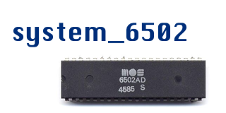
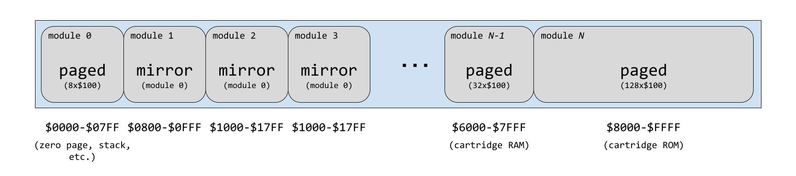

# system_6502



One evening while perusing YouTube for interesting videos on math olympiad problems and NES/SNES developer documentaries, I was pointed at a guy who decided to write a MOS 6502 simulator in C++.  I cut my assembly/machine code teeth back in the 1990's on an Apple IIc with a 6502 processor:  my curiosity was piqued.  And so I set about writing my own emulator for the 6502 ISA.

The best resource I found for my effort was [this summary of the architecture](https://www.masswerk.at/6502/6502_instruction_set.html).  Additional information on binary decimal mode as found on [this forum post](https://stackoverflow.com/questions/29193303/6502-emulation-proper-way-to-implement-adc-and-sbc).  Assembly programs were compiled using an [online assembler/disassembler](http://skilldrick.github.io/easy6502/).

## Organization

### Registers

The 6502 register set is presented as a data structure containing the 8-bit accumulator (A), X- and Y-index (X, Y), and status register (SR); and the 16-bit program counter (PC).

### Memory

Memory is implemented as a virtual 64 KiB address bus ("membus") into which zero or more modules can be interfaced.  Each module is associated with an address range and is ordered relative to other modules by a *tier* value.  This allows for overlaying of modules — in fact, memory watchpoints are implemented as a membus module.  The simplest membus consists of only the IRQ, RES, and NMI vectors.  The next simplest has a single `std64k` module present which wraps an array of 65536 bytes.  The native RAM for a NES would be a 2 KiB `paged` module that wraps eight pages at `$0000` through `$07FF` (zero page, stack page, and six pages for general use).  The NES used extensive mirroring of the same physical RAM to multiple address ranges:  a "mirror" module is available to interface a single membus module with additional address ranges.  A generic map of modules used to construct the NES membus is shown below:



### ISA

Each 6502 instruction is implemented as a staged callback function implemented in source files found in the [isa_6502](isa_6502/) directory.  After the opcode has been fetched and decoded (cycle 0), the appropriate callback is called and instruction handling begins at cycle 1.  Every implemented combination of instruction and addressing mode behaves as the physical CPU would:  an `LDA $2000` taking 4 cycles in reality equates with the operand fetch and three calls to the callback function.

The 6502 opcodes map their 8 bits to the pattern `aaabbbcc`.  There are at most 256 combinations of instruction and addressing mode, so an array of 256 instruction records forms the decode dispatch table.  The table is organized as a 3-dimensional array indexed by integers equating with the bit patterns `cc`, `aaa`, and finally `bbb`.  Unimplemented instruction/mode combinations are given a sentinel value that indicates that fact, so the virtual machine can react accordingly.

An executor object bundles the registers, memory, and ISA together into a single entity and facilitates the kickoff of the instruction-processing pipeline.

#### Future extension

The code is structured such that augmented 6502 ISAs can also be implemented.  In theory, additional staged callback functions or modified functions would be assembled into additional decode dispatch tables.  The API already includes a method by which the consumer can select which ISA dialect to configure at runtime.

As proof of concept, the baseline 65C02 extended instructions and additional addressing modes are present as the `isa_6502_dialect_65C02` dialect.  Information about the functionality (minus Rockwell and WDC additions) was found on [this web page](isa_6502_dialect_65C02), with additional explanations of the new addressing modes [found here](http://www.6502.org/users/obelisk/65C02/addressing.html).


## Building the software

The project includes a CMake build system configuration.

```
$ mkdir build
$ cd build
$ cmake ..
$ make
```

## Examples

The `cc65` compiler can be used to assemble the code in the [examples/src](./examples/src) directory manually.  The program in [multiply_by_3.s](./examples/src/multiply_by_3.s) can be compiled using `cl65 -cpu 6502 -t none -o multiply_by_3.bin multiply_by_3.s` and then executed at it's origin of `$2000`:

```
$ ./system_6502 -l ../examples/multiply_by_3.bin@0x2000:56 -d 0x2000:56 -q -x 0x2000:56 -s multiply_by_3.out@0x2100:0x100
INFO:  read 56 ($0038) bytes into memory range $2000-$2037
2000 : A2 00 A0 00 CA D0 FD 88    D0 FA A2 00 8A 9D 00 21    ...............!
2010 : E8 D0 F9 A2 00 20 2A 20    E8 20 2A 20 E8 20 2A 20    ..... * . * . * 
2020 : E8 20 2A 20 E8 D0 EE 4C    37 20 48 BD 00 21 0A 7D    . * ...L7 H..!.}
2030 : 00 21 9D 00 21 68 60 00                               .!..!h`.
INFO:  executing from $2000-$2037
INFO:  2.5e+08 cycles per second
INFO:  wrote 256 ($0100) bytes from memory range $2100-$21FF

$ hexdump -C multiply_by_3.out
00000000  00 03 06 09 0c 0f 12 15  18 1b 1e 21 24 27 2a 2d  |...........!$'*-|
00000010  30 33 36 39 3c 3f 42 45  48 4b 4e 51 54 57 5a 5d  |0369<?BEHKNQTWZ]|
00000020  60 63 66 69 6c 6f 72 75  78 7b 7e 81 84 87 8a 8d  |`cfilorux{~.....|
00000030  90 93 96 99 9c 9f a2 a5  a8 ab ae b1 b4 b7 ba bd  |................|
00000040  c1 c4 c7 ca cd d0 d3 d6  d9 dc df e2 e5 e8 eb ee  |................|
00000050  f1 f4 f7 fa fd 00 03 06  09 0c 0f 12 15 18 1b 1e  |................|
00000060  21 24 27 2a 2d 30 33 36  39 3c 3f 42 45 48 4b 4e  |!$'*-0369<?BEHKN|
00000070  51 54 57 5a 5d 60 63 66  69 6c 6f 72 75 78 7b 7e  |QTWZ]`cfilorux{~|
00000080  81 84 87 8a 8d 90 93 96  99 9c 9f a2 a5 a8 ab ae  |................|
00000090  b1 b4 b7 ba bd c0 c3 c6  c9 cc cf d2 d5 d8 db de  |................|
000000a0  e1 e4 e7 ea ed f0 f3 f6  f9 fc ff 02 05 08 0b 0e  |................|
000000b0  11 14 17 1a 1d 20 23 26  29 2c 2f 32 35 38 3b 3e  |..... #&),/258;>|
000000c0  41 44 47 4a 4d 50 53 56  59 5c 5f 62 65 68 6b 6e  |ADGJMPSVY\_behkn|
000000d0  71 74 77 7a 7d 80 83 86  89 8c 8f 92 95 98 9b 9e  |qtwz}...........|
000000e0  a1 a4 a7 aa ad b0 b3 b6  b9 bc bf c2 c5 c8 cb ce  |................|
000000f0  d1 d4 d7 da dd e0 e3 e6  e9 ec ef f2 f5 f8 fb fe  |................|
00000100
```

250 MHz isn't too shabby.

The examples can be built from within the `examples` directory as a standalone CMake project or by configuring the overarching system_6502 CMake build with `-DENABLE_EXAMPLES_BUILD`.  In both cases, the `ca65` and `cl65` programs must be present on your PATH.

### Bit Reorder

Given a byte consisting of the bits in sequence `[76543210]`, produce the byte with those bits reordered in sequence `[01234567]`.

All algorithms expect the input to the bit reorder to be present in memory location `$00`.  The result is written back to `$00` when complete.

The 6502 ROR/ROL instructions move the carry register into the byte and reset the carry register with the bit value exiting the byte:  for ROR, `C -> [C7654321] -> [0] -> C`.  The ROL instruction alters the direction of the shift:  `C -> [6543210C] -> [7] -> C`.  In [example 1](examples/bit_reorder_1.s), the original byte and reordered byte are swapped in and out of the accumulator 7 times, with a ROR removing the low-end bit from the original byte and a ROL shifting it into the reordered byte.  The final iteration is unrolled to remove setup for the next iteration.  The assembled code is 20 bytes.

In [example 2](examples/bit_reorder_2.s), the initial iteration of the loop is unrolled:  the first ROR of the original byte determines the starting value of the result — 0 or 1 – with an immediate load into the Y register (where the result goes when swapped out of the accumulator).  The assembled code is 27 bytes.

A reportedly optimal software algorithm for this operation appeared on a [stackoverflow forum](https://stackoverflow.com/a/2602885) in C.  Given the ROR/ROL functionality in the previous examples, does that algorithm translate to any savings (memory or time) in 6502 machine code?  [Example 3](examples/bit_reorder_3.s) implements that algorithm and uses the input/output memory location `$00` to store temporary results.  This is necessary because the bitwise opcodes — like `ORA` — have a single operand, with the accumulator itself being the implied second operand.  There's no way to OR the accumulator against the X register, for example, so reconstructing the two bit patterns in each step requires storing the operand somewhere, and since `$00` will be overwritten on output anyway, it was a natural choice.  The assembled code is 50 bytes.

Loop unrolling is often used as an optimization strategy (at the expense of program size).  [Example 4](examples/bit_reorder_4.s) takes the algorithm from examples 1 and 2 and explicitly codes all 8 ROR/ROL operations without a looping structure.  It is just 2 bytes larger than example 3 at 52 bytes.

One optimization attempted on example 3 is making the code self-altering.  Rather that performing bitwise OR against a memory location, an immediate mode `ORA #$XX` is present in the code.  Rather than storing intermediate halves to `$00`, the code alters the operand to those `ORA #$XX` instructions on-the-fly.  Since the code is assembed at `$2000` the memory write to an absolute address will require an additional cycle versus writing to zero page memory.  The `ORA #$XX` saves a cycle over `ORA $00`, so we've effectively saved no cycles over the original variant in example 3, but we have added 3 more bytes to the code of example 4.  Those bytes and 3 additional cycles could be saved if the code were running in the zero page, but that's generally not a good idea and literally just reintroduces a write to zero page that we were trying to work around!  The assembled code for [Example 5](examples/bit_reorder_5.s) is 47 bytes.

To summarize, then:

| Example | Code Size | Relative Size |Cycle Count | Relative Count |
| :-----: | :-------- | ------------: |----------: | -------------: |
|    1    | 20 bytes  |               |        156 |          +117% |
|    2    | 27 bytes  |         +35%  |        141 |           +96% |
|    3    | 44 bytes  |        +120%  |         72 |                |
|    4    | 52 bytes  |        +160%  |        100 |           +39% |
|    5    | 47 bytes  |        +135%  |         72 |                |

Indeed, example 3 is the most efficient algorithm for the bit reordering, at a cost of 120% larger code versus example 1 but at a nearly equivalent 117% faster execution.  Example 4 (full loop unroll) is slightly larger and slightly slower than example 3.  Examples 1 and 2 only win on code size, executing circa 100% slower than example 3 in both cases.

Example 3 is similar to a worst-case binary sort:  the list of 8 bits is partition and swapped, then each of the 4-bit lists are partitioned and swapped, and finally each 2-bit list is partitioned and swapped.  In terms of arithmetic/bitwise operations, there are 14 bit shifts, 4 ANDs, and 3 ORs; example 1 uses 16 bit shifts but spends more cycles moving data between registers so that all ROR/ROL operations happen w.r.t. the accumulator.

If we remove the restriction that all ROR/ROL happen in the accumulator (fastest addressing mode for those instructions) and make judicious use of LSR in lieu of ROR, we arrive at [Example 6](examples/bit_reorder_6.s).  No additional memory locations, registers, or stack space is used, and it assembles to 15 bytes — the smallest of the programs.  It still requires 96 cycles to execute, though, so example 3 remains the winner.

However, the loop has gotten very tight now — just two bit-shift instructions — that some unrolling may be useful.  [Example 7](examples/bit_reorder_7.s) unrolls the loop and assembles to 28 bytes, a 36% savings over example 3.  And it executes in 59 cycles, or 18% faster than example 3.

| Example | Code Size | Relative Size |Cycle Count | Relative Count |
| :-----: | :-------- | ------------: |----------: | -------------: |
|    1    | 20 bytes  |               |        156 |          +117% |
|    2    | 27 bytes  |         +35%  |        141 |           +96% |
|    3    | 44 bytes  |        +120%  |         72 |                |
|    4    | 52 bytes  |        +160%  |        100 |           +39% |
|    5    | 47 bytes  |        +135%  |         72 |                |
|    6    | 15 bytes  |         -25%  |         96 |           +33% |
|    7    | 28 bytes  |         +40%  |         59 |           -18% |

Example 3 is easily expressed in higher-level languages like C.  But example 7 leverages the properties of 6502 machine code to produce a time- and memory-efficient solution.
